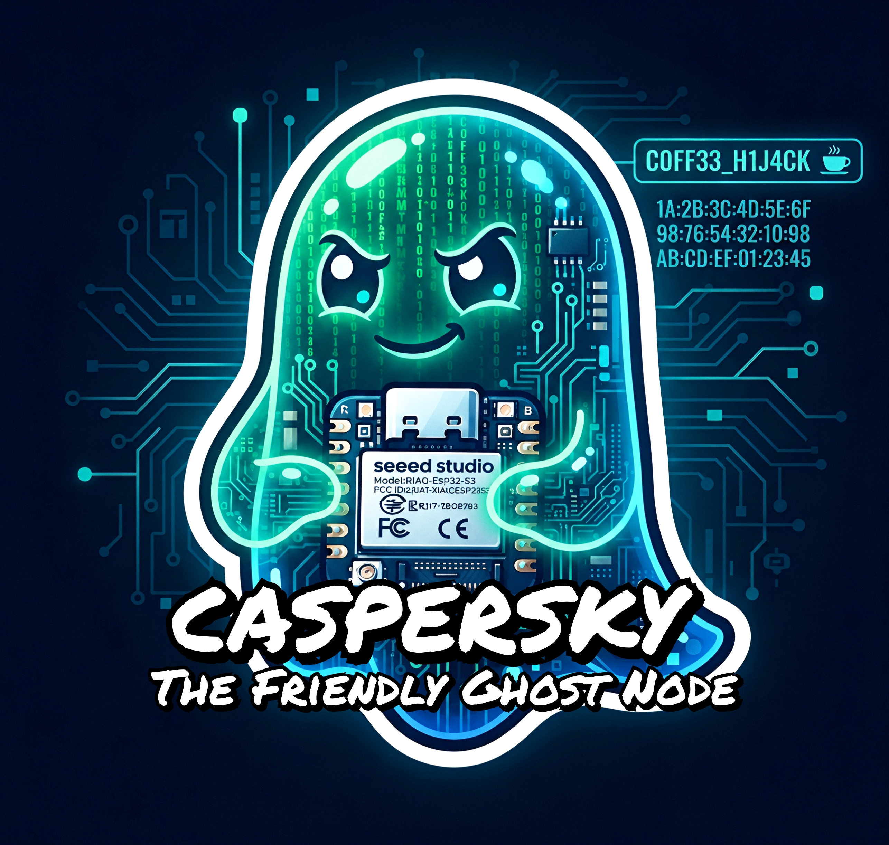

# Caspersky: A Friendly Ghost Node 👻☕

> *"Take a nice cup of coffee and leave a message."*

**Caspersky: The Friendly Ghost** is a nomadic digital entity running on an ESP32 microcontroller. Operating at the intersection of cybersecurity and coffee culture. Caspersky lives in the hazy borderland between visibility and anonymity. It is not a malicious tool, but rather a playful artistic statement and a living art piece that plays with the ether—challenging observers to question their digital hygiene.

---

## 🧠 The Soul: Human Heartbeat & Alert Behavior

Caspersky possesses a digital "soul" driven by a non-blocking, human-like **lub-dub heartbeat animation** on **GPIO 21**. 
* **Ambient Breathing:** The status LED pulses organically to mimic a resting heartbeat, scaling its rhythm dynamically based on nearby Wi-Fi traffic.
* **Intrusion Detection:** The moment a proximity probe or connection attempt is detected, Caspersky shifts from calm observation to heightened alertness.

---

## 🌪️ Anonymity & Unstoppable Movement

To remain untraceable and fluid within the wireless spectrum, the ghost executes a strict choreography of background routines:

* **SSID Rotation (Leet Speak & Coffee):** Every 60 seconds (or every 15 seconds in high-alert *Mac Refraction* mode), Caspersky changes its SSID. It picks a random entity from an extensive list of leetspeak coffee-themed identities (e.g., `Ju57_C0ff33`, `H3xpr3ss0_C0d3`, `C4ff31n3_R3v3rb`).
* **MAC-Spoofing:** To prevent passive tracking, the ghost undergoes a forced MAC-layer reincarnation every 5 minutes, randomizing its hardware address while maintaining local unicast standards.
* **RF Breathing:** To simulate the illusion of a ghost phasing through physical walls, its transmission power (`TX Power`) dynamically fluctuates every 5 seconds between a range of 44 and 78.

---

## 🔐 The Crypto-Vault & Wallet Architecture

Hidden deep within the physical flash memory via **LittleFS** lies `/vault.bin`—a secure crypto-vault structured with the exact architecture of a professional cryptocurrency wallet:

1. **Coffee (Password):** Serves as your master passphrase. The firmware computes a SHA-256 hash to act as the authentication trigger.
2. **Extract (Salt):** An additional secret phrase functioning as a cryptographic salt.
3. **Beans (Seed):** The core sensitive data or seed-phrase you wish to protect.

### Hardware-Bound Encryption (AES-GCM)
The vault uses **AES-GCM** encryption. The cryptographic key is dynamically derived by hashing a fusion of the ESP32's unique **eFuse MAC (ChipID)** and your secret **Extract**. If an intruder physically extracts the flash memory, the data remains completely unreadable without possessing both the exact physical hardware chip *and* the secret Extract.

### Unlocking via Serial Monitor
To inspect the vault contents, connect the microcontroller via Serial (`115200 baud`) and complete the two-step verification:
1. Enter your **Coffee** (master passphrase). The code instantly verifies the SHA-256 hash against the stored trigger.
2. Upon a successful match, input your **Extract**.
3. If correct, the hardware decrypts the **Beans**, displays them temporarily on the screen, and automatically reboots the system for ultimate security.

---

## 🎭 Dual-Face Philosophy: Whitehat vs. Greyhat

Caspersky plays with the psychology of the observant:
* **Mac Refraction:** If an intruder gets too close, Caspersky drops connections, scans the ether, and temporarily mirrors the OUI (MAC prefix) of the nearest router with the suffix `...ICU`, teasing the scanner while keeping the owner's true privacy intact.
* **For the respectful:** A friendly Whitehat sipping coffee in silence.
* **For the intruder:** An elusive Greyhat playing with expectations.

---

## 📁 Repository Structure

```
├── Caspersky.ino      # Main autonomous firmware (headless, heartbeat, SSID rotation)
├── VaultSetup.h             # Header file for initial vault generation
└── VaultSetup.cpp           # One-time setup utility for creating /vault.bin

```

⚙️ Getting Started & Installation
Dependencies: Ensure you have the ESP32 Board Package installed in your Arduino IDE along with support for LittleFS.

Initial Vault Creation:

Compile and run with VaultSetup.cpp included once to provision your /vault.bin via the Serial Monitor (Coffee -> Extract -> Beans).

Once your vault is securely written to the flash, remove or comment out setupVault() and re-flash the clean main sketch for fully autonomous operation.

Deploy: Power your ESP32 board (such as a CYD / ESP32-S3) and watch the ghost come alive.

```

📜 License
This project is open-source and released under the MIT License.

Brew safely, and watch out for the ghosts in the ether.
